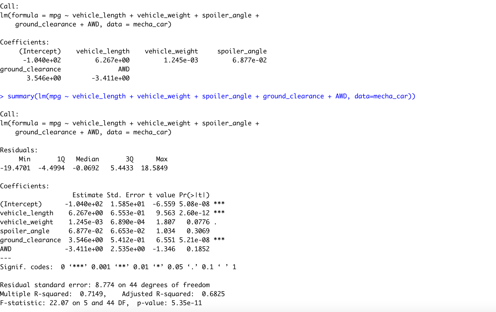
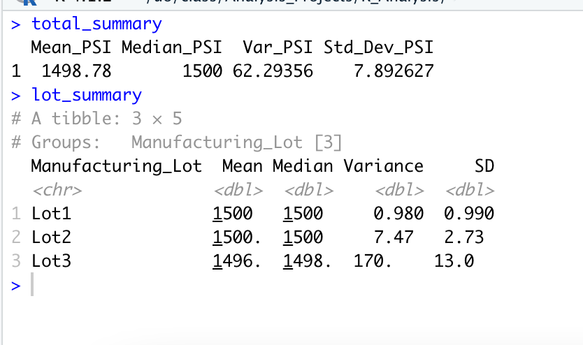
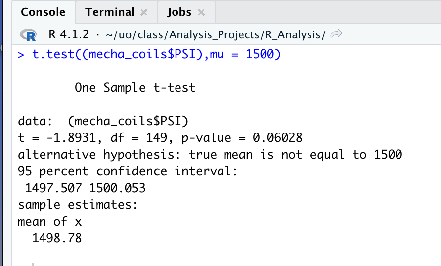
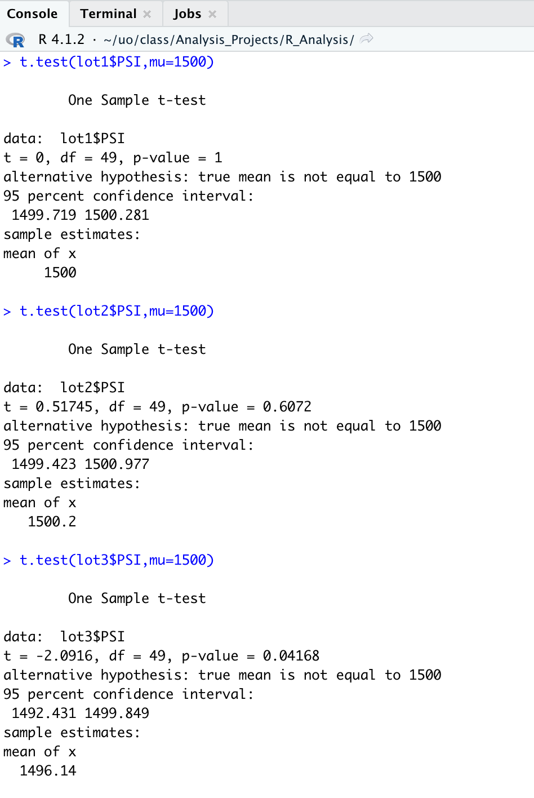

# MechaCar: Statistical Analysis

## Linear Regression to Predict MPG

According to our results, vehicle length and ground clearance provided non-random variance to the mpg in the dataset.

The p-value of our linear regression analysis is 5.35e-11, which is smaller than our assumed significance level. We can reject our null hypothesis; *the slope of our linear model is not zero*.

Our r-squared value is .72, showing a strong positive correlation, so it will predict mpg effectively.

## Summary Statistics on Suspension Coils

Our suspension coil specifications require that the variance must not exceed 100 pounds per square inch. Looking at the total summary, variance is 62, well below 100, meeting our requirement. However, the lot summary shows "Lot 3" with a variance of 170. Therefore, the current data does not meet the specifications for each lot individually.

## T-Tests on Suspension Coils

Assuming our significance level was the common 0.05, our 0.06 p-value is above that level. Therefore, we failed to reject the null hypothesis; however, the margin was only .01.

Lots 1 and 2 p-value is above our significance level and we would state that the two means are statistically similar. We do not have sufficient evidence to reject the null hypothesis. With a p-value of 1 for lot1, we have the strongest indication that they are similar. 

## Study Design: MechaCar vs Competition

We will compare the resale value of the MechaCar to its competition.

What is null hypothesis or alternate hypothesis?

Null hypothesis: Differences in resale vale among MechaCar and its competitors can be explained by random chance.

Alt hypothesis: If MechaCar is perceived an an above-average product, then resale value will be higher for MechaCar than for competitors with the same starting price.

What statistical test to test hypothesis? Why?

Two-sample T-test because resale value is an estimate, based on sample instead of population data.

What data is needed?

MSRP and resale data for MechaCar and for competitors at the same staring price point.